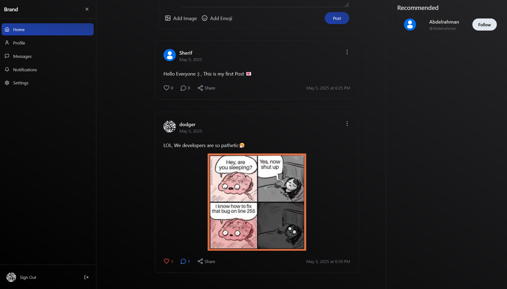

## MERN Social Media App

A full-stack social media application built with the MERN (MongoDB, Express, React, Node.js) stack. Users can sign up, sign in, manage their profiles, create and interact with posts, and follow other users.

---

## Table of Contents

* [Features](#features)
* [Tech Stack](#tech-stack)
* [Getting Started](#getting-started)

  * [Prerequisites](#prerequisites)
  * [Installation](#installation)
  * [Environment Variables](#environment-variables)
  * [Running the App](#running-the-app)
* [Folder Structure](#folder-structure)
* [API Endpoints](#api-endpoints)
* [UI Examples](#ui-examples)
* [Contributing](#contributing)
* [License](#license)

---

## Features

* **Authentication**: Sign up, Sign in, Change password, Delete account using JWT-based authentication.
* **Current User**: Retrieve the authenticated user’s data via a `/me` endpoint to maintain front-end state.
* **Feed**: View your posts and friends' posts in a real-time feed with Create, Read, Update, Delete (CRUD) operations on your own posts.
* **Social**: Follow/Unfollow users, Like and comment on posts.
* **Profiles**: View and edit user profiles, update avatar and bio.
* **Search & Recommendations**: Search for users and see recommended users to follow.
* **Optimistic UI**: Instant updates in the UI using React Context API and custom hooks for optimistic updates.
* **Infinite Scroll**: Automatically load 5 posts per request as the user scrolls.
* **Image Hosting**: User-uploaded images are hosted via ImgBB for reliable CDN delivery.
* **API Documentation**: Interactive Swagger docs available at `/api-docs`.

---

## Tech Stack

| Layer          | Technology                                      |
| -------------- | ----------------------------------------------- |
| Frontend       | React, React Context API, Tailwind CSS, Hero UI |
| Backend        | Node.js, Express                                |
| Database       | MongoDB                                         |
| Authentication | JSON Web Tokens (JWT)                           |
| State & Hooks  | Custom React Hooks, Optimistic UI Updates       |

---

## Getting Started

### Prerequisites

* Node.js (v14 or later)
* npm or yarn
* MongoDB (local or Atlas)

### Installation

1. Clone the repository:

   ```bash
   git clone https://github.com/your-username/mern-social-media-app.git
   cd mern-social-media-app
   ```
2. Install dependencies for both client and server:

   ```bash
   # In root directory
   npm install

   # In client folder
   cd client && npm install
   ```

### Environment Variables

Create a `.env` file in the `server` directory and add the following:

```
MONGODB_URI=your_mongodb_connection_string
JWT_SECRET=your_jwt_secret
PORT=5000
```

In the `client` directory, create a `.env`:

```
REACT_APP_API_URL=http://localhost:5000/api
```

### Running the App

```bash
# Start the server
cd server && npm start

# Start the client
cd client && npm start
```

The app will be available at `http://localhost:3000`.

---

## Folder Structure

```
mern-social-media-app/
├── server/                 # Express server
│   ├── controllers/        # Route handlers
│   ├── models/             # Mongoose schemas
│   ├── routes/             # API routes
│   ├── middleware/         # Auth, error handling
│   ├── .env                # Environment variables
│   └── server.js           # Entry point
├── client/                 # React app
│   ├── public/
│   ├── src/
│   │   ├── components/     # Reusable UI components
│   │   ├── hooks/          # Custom React hooks
│   │   ├── context/        # React Context & state
│   │   ├── pages/          # Route pages
│   │   ├── utils/          # Helpers & API calls
│   │   ├── App.js
│   │   └── index.js
│   └── tailwind.config.js
├── screenshots/            # UI example screenshots
├── README.md
└── package.json
```

---

## API Endpoints

| Method | Endpoint                           | Description                                          |
| ------ | ---------------------------------- | ---------------------------------------------------- |
| POST   | `/api/auth/signup`                 | Register a new user                                  |
| POST   | `/api/auth/signin`                 | Authenticate user & get token                        |
| GET    | `/api/auth/me`                     | Get current authenticated user (for front-end state) |
| PUT    | `/api/auth/password`               | Change password                                      |
| DELETE | `/api/auth/delete`                 | Delete user account                                  |
| GET    | `/api/posts`                       | Get feed posts                                       |
| POST   | `/api/posts`                       | Create a new post                                    |
| PUT    | `/api/posts/:id`                   | Update a post                                        |
| DELETE | `/api/posts/:id`                   | Delete a post                                        |
| POST   | `/api/posts/:id/comment`           | Add comment to a post                                |
| POST   | `/api/posts/:id/like`              | Like/unlike a post                                   |
| GET    | `/api/users/:id`                   | Get user profile                                     |
| PUT    | `/api/users/:id`                   | Update user profile                                  |
| POST   | `/api/users/:id/follow`            | Follow/unfollow a user                               |
| GET    | `/api/users/search?q=`             | Search for users                                     |
| GET    | `/api/posts?limit=5&page=<number>` | Infinite scroll: fetch 5 posts per request           |

---

## UI Examples

Below are some screenshots showcasing the main UI screens. Screenshots are located in the `screenshots/` folder and rendered inline using Markdown.

| Screen                   | Preview                                                             |
| ------------------------ | ------------------------------------------------------------------- |
| Land Page                |                              |
| Signup                   |                            |
| Login                    |                            |
| Feed & Posts             |                                |
| Profile Page             |                             |
| Create Post              |                           |
| Post detail              |                        |
| Update Profile           |                     |
| Settings                 |                     |
| Search                   |                  |
| Recommendataion          |             |
| 404                      |             |
| Comming Soon             |             |

---

## Contributing

Contributions are welcome! Please open an issue or submit a pull request.

1. Fork the repo
2. Create your feature branch (`git checkout -b feature/YourFeature`)
3. Commit your changes (`git commit -m "Add some feature"`)
4. Push to the branch (`git push origin feature/YourFeature`)
5. Open a pull request

---

## License

This project is licensed under the MIT License. See the [LICENSE](LICENSE) file for details.
